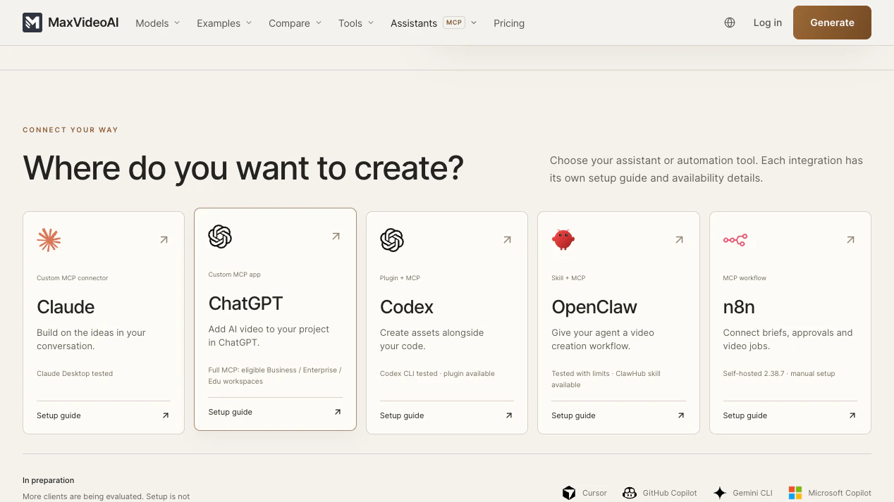
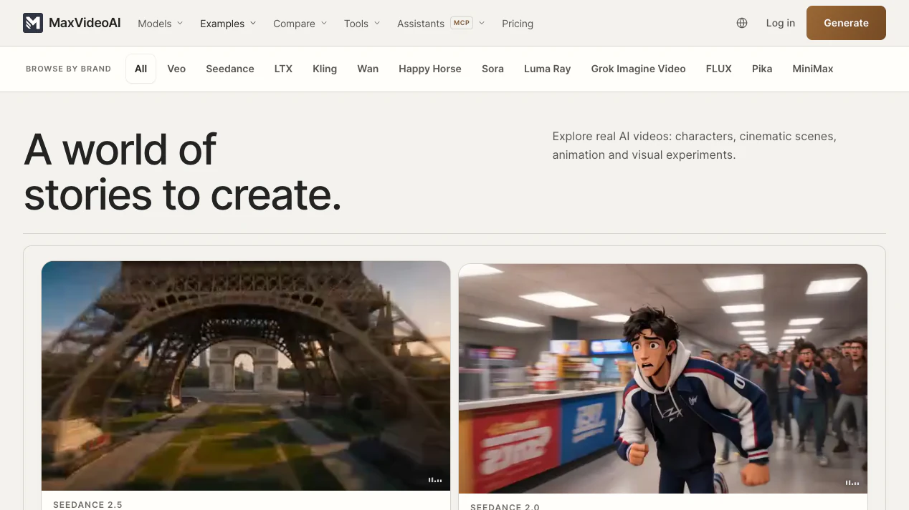
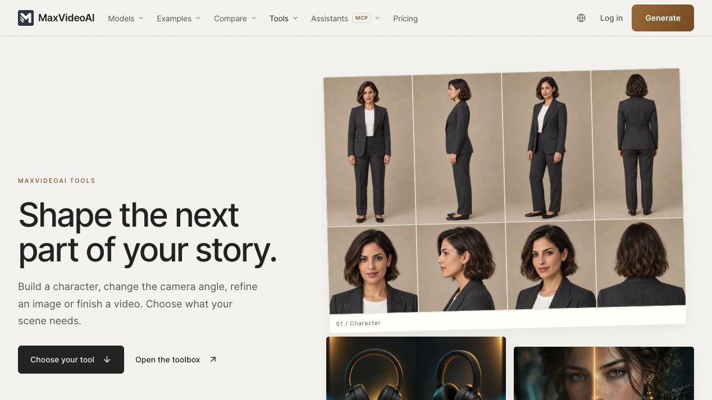

# MaxVideoAI for assistants, agents, and automations

MaxVideoAI is a multi-model AI production service exposed through one remote MCP server. It gives assistants, agents, and approved automations a controlled path to plan video and image work, compare current models, budget projects, prepare exact quotes, approve one paid attempt, recover results, and keep work in the connected MaxVideoAI Library.

**Plan. Compare. Price. Approve. Generate. Recover.**

Setup guides: [Claude](docs/claude.md) · [ChatGPT](docs/chatgpt.md) · [Codex](docs/codex.md) · [OpenClaw](https://maxvideoai.com/integrations/openclaw) · [n8n](https://maxvideoai.com/integrations/n8n) — see [current compatibility and protocol details](https://maxvideoai.com/docs/mcp).



[Plan a production](https://maxvideoai.com/mcp?utm_source=github&utm_medium=repository&utm_campaign=assistant_video_plugin&utm_content=hero_connect) · [Compare models](https://maxvideoai.com/models) · [Review pricing](https://maxvideoai.com/pricing?utm_source=github&utm_medium=repository&utm_campaign=assistant_video_plugin&utm_content=pricing)

### Install the repository-validated Codex package

```sh
codex plugin marketplace add camgraphe/maxvideoai-plugin --ref v0.3.5
codex plugin add maxvideoai@maxvideoai
```

Start a new Codex task, then ask `$maxvideoai:plan` to compare a production route or `$maxvideoai:generate` to prepare a concrete request. The plugin is free to connect. The first live MaxVideoAI action opens OAuth so you can sign in or create the account you want to connect.

[Public releases](https://github.com/camgraphe/maxvideoai-plugin/releases) include a versioned ZIP and SHA-256 file. Match the selected public tag to `VERSION` before installation.

## What does MaxVideoAI add to an AI assistant?

The assistant owns the creative conversation; MaxVideoAI supplies current product truth and the controlled execution path. It can read live model details, compare compatible options, calculate complete project budgets, select account-owned media, validate concrete settings, return an exact quote, submit one approved attempt, follow the accepted job, and present the finished result.


The same connected account and Library are used on the website and through the plugin. There is no separate plugin subscription; approved generations use existing MaxVideoAI credits at current pay-as-you-go prices.

## Which setup should you use?

- **Claude:** add the remote connector/plugin, complete OAuth, then begin with a no-spend plan. Follow the [Claude guide](docs/claude.md).
- **ChatGPT:** connect the direct MCP in developer mode and complete OAuth on first use. MaxVideoAI is not submitted to the OpenAI directory under the current commerce policy. Follow the [ChatGPT guide](docs/chatgpt.md).
- **Codex:** install the tagged public package, open a new task, and call `$maxvideoai:plan` or `$maxvideoai:generate`. Follow the [Codex guide](docs/codex.md).

### Agent and automation paths

```text
Direct host paths: Claude · ChatGPT · Codex
Agent and automation paths: OpenClaw · n8n
```

- **OpenClaw:** the remote MCP path is **tested with limits** around private references, channel attachments, and inline channel rendering; the packaged skill is listed on ClawHub. Follow the [OpenClaw guide](https://maxvideoai.com/integrations/openclaw).
- **n8n:** on tested self-hosted n8n, use the deterministic MCP Client workflow with manual configuration. n8n Cloud and MCP Client Tool agent invocation are not claimed. Follow the [n8n guide](https://maxvideoai.com/integrations/n8n).
- **Another MCP client:** connect only if the client supports remote Streamable HTTP and OAuth. Follow the [generic MCP guide](docs/generic-mcp.md).

Every route connects to `https://api.maxvideoai.com/mcp`. Add that URL exactly as written—without a token, query string, password, or API key.

Cursor, GitHub Copilot, Gemini CLI, and Microsoft Copilot are in preparation. They do not yet have public MaxVideoAI setup paths.

```text
Connect → OAuth on first use → plan without spending → prepare quote → approve once → recover result
```

## What can you create?

Start from a brief, a supported private reference, or a public example. The plugin can help turn that material into a shot plan and a model-aware request, while the MaxVideoAI gallery gives you concrete prompts, settings, durations, and recorded render costs to inspect before building your own version.



[Explore AI video examples](https://maxvideoai.com/examples) or copy one of the [four practical agent workflows](examples/README.md).

## How do you compare models side by side?

Use `$maxvideoai:plan` in Codex or `/maxvideoai:plan` in Claude Code. Planning reads current model facts and builds comparable, named production routes without authorizing generation. Ask for one consistent-model route, a deliberate model mix, a quality-focused plan, or a credible lower-cost alternative using the same shot assumptions.


The [engine comparison hub](https://maxvideoai.com/ai-video-engines) and [model directory](https://maxvideoai.com/models) expose the current decision surface. A recommendation is a capability match for the brief, not a guarantee of provider availability or a paid quote.

## How do pricing and approval stay clear?

A project budget is useful while you are choosing a direction. When the model, prompt, settings, and required references are concrete, `$maxvideoai:generate` or `/maxvideoai:generate` prepares the exact price for that request. Nothing is submitted as paid work until you explicitly approve that quote, and the approval covers one attempt.


1. **Plan:** compare current model options and complete project budgets without spending credits.
2. **Prepare:** validate the selected request and supported private references.
3. **Price:** receive the exact quote for those settings.
4. **Approve:** explicitly authorize one paid attempt.
5. **Recover:** follow the accepted job before considering another submission.

## Which preparation and finishing tools are available?

The public [MaxVideoAI toolbox](https://maxvideoai.com/tools) covers repeatable work around generation: character sheets, camera-angle exploration, image refinement, background removal, and video finishing. It keeps the next production step visible without implying that every tool is part of this plugin package or available through every MCP host.



Use the live tool page for current inputs and prices. The remote MCP exposes only the capabilities in its current tool contract.

The current live MCP surface covers video and image planning, quoting, generation, recovery, and private-reference handling. Audio generation and Studio montage are implemented behind server publication gates and are not claimed as live by this package. Trust the tool inventory scanned by the connected client over screenshots, examples, or remembered capability names.

## How do private references and the Library work?

Compatible ChatGPT or Claude surfaces can import authorized attachments and generated results as private MaxVideoAI assets without a public URL or Computer Use. Codex and Claude Code use the packaged local helper when a host cannot expose a temporary file handle directly. The helper reads local bytes itself; it does not publish the file or pass a raw local path to the MCP server.


Private references and finished generations remain in the connected MaxVideoAI Library. If a response is interrupted after submission, recover the accepted job or recent generation before preparing another paid attempt. Read [privacy and permissions](docs/privacy-and-permissions.md) and [reference input handling](skills/generate/references/reference-inputs.md) for the complete boundary.

[Open the MaxVideoAI Library](https://maxvideoai.com/app/library?utm_source=github&utm_medium=repository&utm_campaign=assistant_video_plugin&utm_content=library) to continue with saved results and private media.

## Try asking

```text
Compare current AI video models for a 20-second product film. Give me a
quality-focused route and a credible lower-cost route using the same shot
assumptions. Do not prepare paid work yet.

Use my authorized product image as the first frame where the selected workflow
supports it. Prepare the exact quote, but wait for my explicit approval.

The conversation stopped after approval. Check the accepted job before you
consider another paid submission, then recover the result in my MaxVideoAI Library.
```

More workflows:

- [Compare current AI video models](examples/compare-ai-video-models.md)
- [Price an AI video project](examples/price-a-video-project.md)
- [Plan a Claude production](examples/claude-video-production.md)
- [Run a Codex production workflow](examples/codex-video-production.md)

## How is the plugin packaged?

The repository is deliberately reviewable. It contains host manifests, one remote MCP endpoint, two scoped skills, human setup guides, producer examples, community files, release graphics, and a deterministic public-bundle builder.

```text
.mcp.json                         remote MCP connection
.claude-plugin/                   Claude package metadata
.codex-plugin/                    Codex package metadata
skills/plan/                      model comparison and project budgeting
skills/generate/                  quote, approval, execution and recovery
docs/                             host setup, privacy and troubleshooting
examples/                         copyable production workflows
scripts/import-reference-files.mjs local private-file helper
```

The MCP server uses OAuth and keeps pricing, account data, private media, jobs, and provider execution on the MaxVideoAI side. The host keeps the creative conversation and prompt development. Read [how it works](docs/how-it-works.md) for the complete division of responsibility.

## How do you validate a contribution or release?

From the source repository root:

```bash
pnpm github:content:check
pnpm github:assets:release-check
node --test --import tsx tests/github-content-contract.test.ts
node --test --import tsx tests/mcp-public-release-bundle.test.ts
```

The release builder exports an exact allowlisted file set, validates every referenced image against the asset manifest, rejects secrets and unsafe paths, writes SHA-256 checksums, and produces the versioned archive used by the dedicated public repository.

See [CONTRIBUTING.md](CONTRIBUTING.md) for review scope, [SECURITY.md](SECURITY.md) for private vulnerability reporting, and [SUPPORT.md](SUPPORT.md) for product and compatibility help.

Policies and product help: [privacy](https://maxvideoai.com/legal/privacy) · [terms](https://maxvideoai.com/legal/terms) · [contact](https://maxvideoai.com/contact) · [support@maxvideoai.com](mailto:support@maxvideoai.com) · [Business Source License 1.1](LICENSE).

Last reviewed: 2026-09-16.
