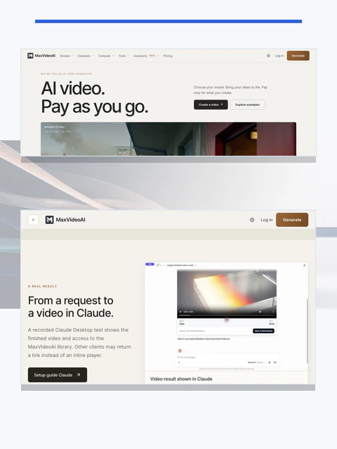
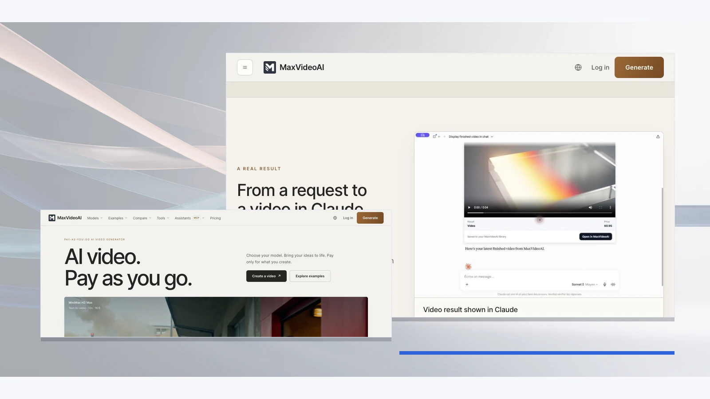

# How MaxVideoAI keeps planning and paid generation separate

**Short answer:** `$plan` helps choose current models and build comparable budgets without spending credits. `$generate` prepares one concrete request, returns its exact quote, waits for explicit approval, authorizes exactly one paid attempt, and recovers the accepted job instead of silently submitting another.

## What does the planning workflow do?



This is current MaxVideoAI product proof, not native host proof. The image shows product selection and a completed result; it is not a quote, approval, or budget proof.

Planning asks the live MaxVideoAI catalogue for current executable options. It can inspect model details, recommend options for each shot, and calculate comparable named project budgets. A budget is a decision aid, not an exact generation quote, and planning does not authorize paid work.

## How does paid generation stay deliberate?

The generation workflow validates the selected model, prompt, settings, and supported references before returning an exact quote. It then stops. An ambiguous “go ahead” without the quoted context is not approval. Explicit approval of that quote authorizes exactly one paid attempt.

**Example**: “Prepare this five-second image-to-video request and show the exact quote. Stop until I explicitly approve that quote.”

MaxVideoAI is free to connect and has no separate plugin subscription. Approved generation uses credits from the connected MaxVideoAI account on a pay-as-you-go basis.

## What happens if the conversation is interrupted?



After MaxVideoAI accepts a paid job, a timeout or lost response is not permission to submit again. Ask for that job's status or recent generations first. Present the completed result, or report the refunded outcome, from the existing job.

A technical failure reported as refunded closes the original attempt. The refund does not restore the old approval. Any replacement attempt needs a fresh request, fresh exact quote, and new explicit approval.

## Where do references and results live?

Private image, video, or audio references stay in the connected MaxVideoAI Library and are used only where the selected workflow supports them. Completed generations return to that same Library, so a later conversation can recover or reuse the owned result without exposing raw internal identifiers as the main experience.

## How do I disconnect and revoke access?

Remove or disable MaxVideoAI in the host's connector or plugin settings. Then revoke the matching OAuth connection in your MaxVideoAI account connection settings. These are two separate controls: removing the host integration stops that host from invoking MaxVideoAI, while OAuth revocation closes the account authorization. Reconnecting later requires a fresh browser OAuth flow.

```text
Host: remove or disable the MaxVideoAI connector or plugin
MaxVideoAI: revoke the matching OAuth connection
```

## Sources

- [MaxVideoAI connection guide](https://maxvideoai.com/docs/mcp)
- [Planning workflow contract](../skills/plan/SKILL.md)
- [Generation workflow contract](../skills/generate/SKILL.md)

Last reviewed: 2026-08-28.
