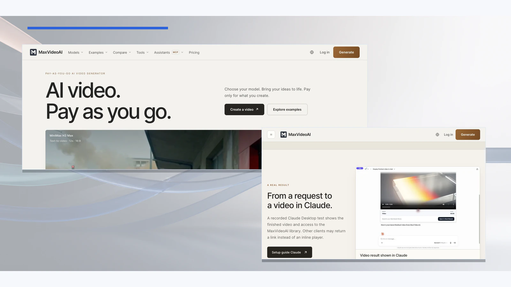

# Plan a Claude video-production request safely

**Short answer:** In an eligible Claude setup, use MaxVideoAI for a no-spend plan first, then request a concrete exact quote only when the production is ready. Host controls and connector availability can change, so validate the path in your own account before relying on it.



*This current MaxVideoAI product visual proves a completed result continuing into the Library. It does not prove a native Claude install, quote, approval, or generation run.*

## What are you trying to produce?

Use a brief that makes the intended shots, quality constraints, and reference needs explicit. Start with planning so the request stays free of a paid-action commitment.

**Prompt to copy:** “Use MaxVideoAI to plan a three-shot launch film. Compare current model routes and named budgets, identify any missing information, and stop before you prepare or approve a generation.”

## What MaxVideoAI should do

After a no-spend `$plan`, choose a concrete shot and use `$generate` only to prepare its request. MaxVideoAI should return an exact quote for that request. Only explicit approval authorizes one paid attempt; browser OAuth connects the MaxVideoAI account you choose.

```text
Brief → no-spend plan → concrete request → exact quote → explicit approval → one paid attempt
```

## What to do after an interrupted response

If approval and submission already happened, ask for the accepted job’s status or recent generations before considering another paid request. Recover the completed result or refunded outcome from the MaxVideoAI Library. A replacement needs a fresh exact quote and new explicit approval.

Follow the [Claude setup guide](../docs/claude.md), review the [current compatibility evidence](https://maxvideoai.com/mcp?utm_source=github&utm_medium=example&utm_campaign=assistant_video_workflows&utm_content=claude_video_production), and keep private references in the approved MaxVideoAI workflow.
