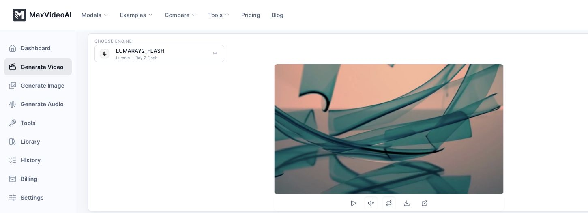

# Turn a private reference into a deliberate video request

Start with the connected MaxVideoAI Library. Reuse an owned reference when it is already available; request a secure upload handoff only when it is missing, then refresh the media selection before preparing a quote.

## What is the intent?

Animate an owned product reference while keeping private media, model validation, spend approval, and the completed result inside a recoverable MaxVideoAI workflow.



*This visual proves the current MaxVideoAI production workspace can show model selection and a completed result. It does not prove reference upload, private-media selection, quote, approval, or native host behavior.*

## What prompt can I copy?

**Prompt to copy**: “Use my existing product image from the MaxVideoAI Library as the opening frame. Validate a current image-to-video option, prepare the exact quote, and stop until I explicitly approve it.”

```text
Describe the Library asset by a safe, recognizable label. Keep credentials and private delivery details out of the prompt.
```

## What is the expected MaxVideoAI behavior?

1. `$generate` checks private Library selection first.
2. If the reference is missing, it offers a secure upload handoff only for that missing asset.
3. After upload, it refreshes media selection rather than relying on stale state.
4. It validates the current model, mode, and supported reference type.
5. It prepares the exact quote and waits for explicit approval before one paid attempt.

**Example**: The workflow should never ask you to paste sensitive transfer material or expose private media in a public report.

## Why is `$generate` appropriate here?

The shot, owned reference, and desired motion are already concrete. `$generate` can validate the executable request and quote it. Use `$plan` first only when the model direction, shot structure, or project budget is still open.

```text
Library first → secure upload if missing → refresh selection → validate → quote → approve once
```

## What if the response is lost after approval?

Recover the accepted job or list recent generations before considering another paid request. Do not upload the reference again merely because the conversation is interrupted. A refund closes the original authorization; any replacement needs a fresh exact quote and new explicit approval.

**Example**: “Find the accepted job and recover its result before you prepare another request.”

## What remains in the MaxVideoAI Library?

The private reference stays in the connected MaxVideoAI Library, and a completed result returns to the same Library for later presentation or reuse. Do not paste a local path, base64 payload, raw token, or arbitrary private URL into a prompt or public issue; use Library selection and the secure upload handoff instead.

Read [privacy and permissions](../docs/privacy-and-permissions.md), use [troubleshooting](../docs/troubleshooting.md) for interrupted work, and verify [current compatibility evidence](https://maxvideoai.com/docs/mcp).

Last reviewed: 2026-08-28.
